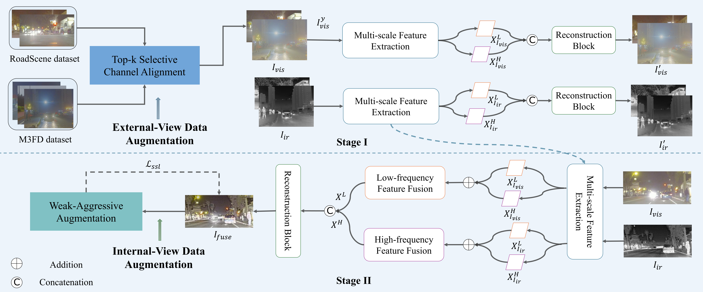

# CrossFuse

## About
Codes for ***CrossFuse: Learning Infrared and Visible Image Fusion by Cross-Sensor Top-K Vision Alignment and Beyond***, **IEEE Transactions on Circuits and Systems for Video Technology (T-CSVT), 2025.**

## Contents

- [Abstract](#Abstract)
- [Installation](#Installation)
- [Dataset](#Dataset)
- [Usage](#Usage)
  - [Training](#Training)
  - [Testing](#Testing)
- [CrossFuse](#CrossFuse)
  - [Network Architecture](#Network-Architecture)
  - [Qualitative results](#Qualitative-results)
  - [Quantitative results](#Quantitative-results)
- [Citation](#Citation)

## Abstract
Infrared and visible image fusion (IVIF) is increasingly applied in critical fields such as video surveillance and autonomous driving systems. Significant progress has been made in deep learning-based fusion methods. However, these models frequently encounter out-of-distribution (OOD) scenes in real-world applications, which severely impact their performance and reliability. Therefore, addressing the challenge of OOD data is crucial for the safe deployment of these models in open-world environments. Unlike existing research, our focus is on the challenges posed by OOD data in real-world applications and on enhancing the robustness and generalization of models. In this paper, we propose an infrared-visible fusion framework based on Multi-View Augmentation. For external data augmentation, Top-k Selective Vision Alignment is employed to mitigate distribution shifts between datasets by performing RGB-wise transformations on visible images. This strategy effectively introduces augmented samples, enhancing the adaptability of the model to complex real-world scenarios. Additionally, for internal data augmentation, self-supervised learning is established using Weak-Aggressive Augmentation. This enables the model to learn more robust and general feature representations during the fusion process, thereby improving robustness and generalization. Extensive experiments demonstrate that the proposed method exhibits superior performance and robustness across various conditions and environments. Our approach significantly enhances the reliability and stability of IVIF tasks in practical applications.

## Installation

## Dataset
Our training dataset can be downloaded from [Google drive](https://drive.google.com/file/d/1DJ4btzAnYLtfh9HcLvWcVtFUA9z3xlSQ/view?usp=drive_link) and placed in the folder ``'./dataset/'.``
Our test sets can be downloaded from [Google drive](https://drive.google.com/drive/folders/1O6iAEOgmo3XBicjL5TPj7HxPPylOk2F_?usp=drive_link) and placed in the folder ``'./test_image/'.``

## CrossFuse

### Network Architecture

**1. Overall Framework**

**2. Top-k Selective Channel Alignment for External Data Consistency**

**3. Internal-View Augmentation for Self-supervised Learning**

